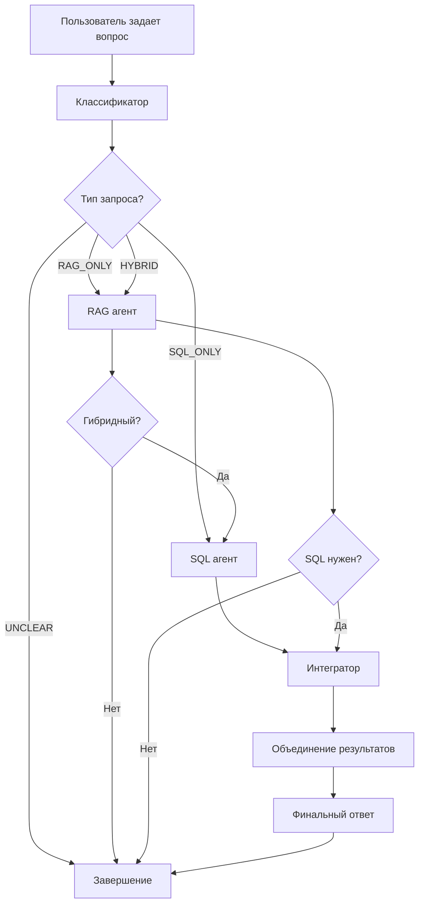

# Архитектура многоагентной RAG системы

## Обзор системы

Многоагентная система использует LangGraph для оркестрации трех специализированных агентов:

1. **Классификатор запросов** - определяет тип запроса
2. **RAG агент** - работает с документами
3. **SQL агент** - работает с базой данных
4. **Интегратор** - объединяет результаты

## Схема работы



## Типы запросов

### RAG_ONLY (только документы)
- Вопросы о политиках компании
- Техническая документация
- Планы проектов
- Процедуры и регламенты

**Пример:** "Какие требования к паролям установлены в компании?"

### SQL_ONLY (только база данных)
- Статистика по сотрудникам
- Данные о проектах и задачах
- Информация об оборудовании
- Инциденты безопасности

**Пример:** "Сколько сотрудников работает в отделе разработки?"

### HYBRID (документы + база данных)
- Анализ соответствия политик реальной ситуации
- Комплексные отчеты по проектам
- Оценка рисков и готовности
- Анализ эффективности

**Пример:** "Какие проекты по безопасности ведутся и какие политики действуют?"

## Компоненты системы

### 1. Классификатор запросов
```python
class QueryClassifier:
    - Анализирует вопрос пользователя
    - Определяет требуемые источники данных
    - Возвращает тип: RAG_ONLY, SQL_ONLY, HYBRID, UNCLEAR
```

### 2. RAG агент
```python
class RAGAgent:
    - Получает контекст из векторной БД
    - Генерирует ответ на основе документов
    - Указывает источники информации
```

### 3. SQL агент
```python
class SQLAgent:
    - Создает SQL запросы
    - Выполняет запросы к PostgreSQL
    - Интерпретирует результаты
```

### 4. Интегратор
```python
class ResultIntegrator:
    - Объединяет результаты RAG и SQL агентов
    - Устраняет противоречия
    - Форматирует финальный ответ
```

## Преимущества подхода

### ✅ Специализация агентов
- Каждый агент оптимизирован для своей задачи
- Лучшее качество ответов в каждой области
- Проще отладка и улучшение

### ✅ Интеллектуальная маршрутизация
- Автоматическое определение нужных источников
- Избежание ненужных вызовов
- Оптимизация производительности

### ✅ Объединение контекста
- Полные ответы на сложные вопросы
- Использование всех доступных данных
- Выявление противоречий между источниками

### ✅ Отказоустойчивость
- Fallback на традиционный подход
- Graceful degradation при ошибках
- Подробное логирование для отладки

## Настройки и оптимизация

### Настройка классификатора
```python
# Добавление новых ключевых слов для классификации
sql_keywords = [
    "сколько", "количество", "список", "статистика",
    "проекты", "сотрудники", "задачи", "оборудование"
]

rag_keywords = [
    "требования", "политика", "процедура", "документация",
    "план", "архитектура", "технические спецификации"
]
```

### Настройка промптов
```python
# Промпт для классификатора - максимально точный
classifier_prompt = """
Определи тип запроса основываясь на источниках данных:
- RAG_ONLY: только документы (политики, планы, процедуры)
- SQL_ONLY: только БД (сотрудники, проекты, статистика)
- HYBRID: нужны оба источника
"""

# Промпт для интегратора - фокус на полноте ответа
integration_prompt = """
Объедини результаты из документов и БД в единый ответ.
Используй ВСЮ доступную информацию.
Укажи источники данных.
"""
```

## Мониторинг и отладка

### Логирование
- Классификация запросов
- Время выполнения каждого агента
- Успешность операций
- Ошибки и fallback'и

### Метрики
- Точность классификации
- Время отклика системы
- Частота использования агентов
- Качество интеграции результатов

## Развитие системы

### Планируемые улучшения
1. **Кэширование результатов** - ускорение повторных запросов
2. **Адаптивная классификация** - обучение на пользовательском поведении
3. **Расширенная интеграция** - поддержка большего количества источников
4. **Streaming ответы** - постепенная выдача результатов

### Возможные расширения
- Добавление агента для работы с API
- Интеграция с внешними сервисами
- Поддержка мультимодальных запросов
- Персонализация ответов по пользователям